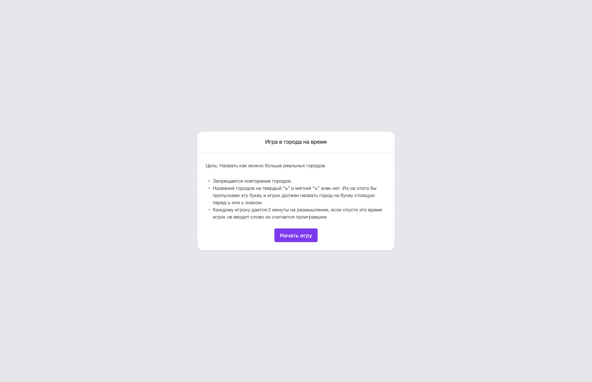
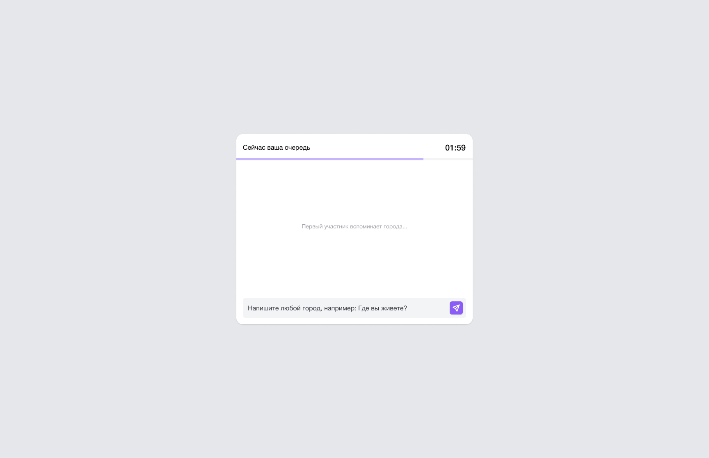
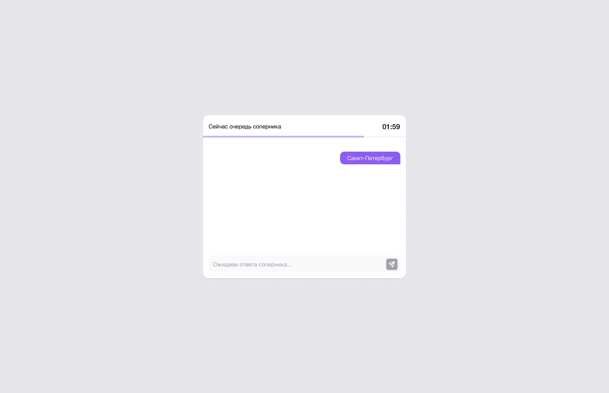
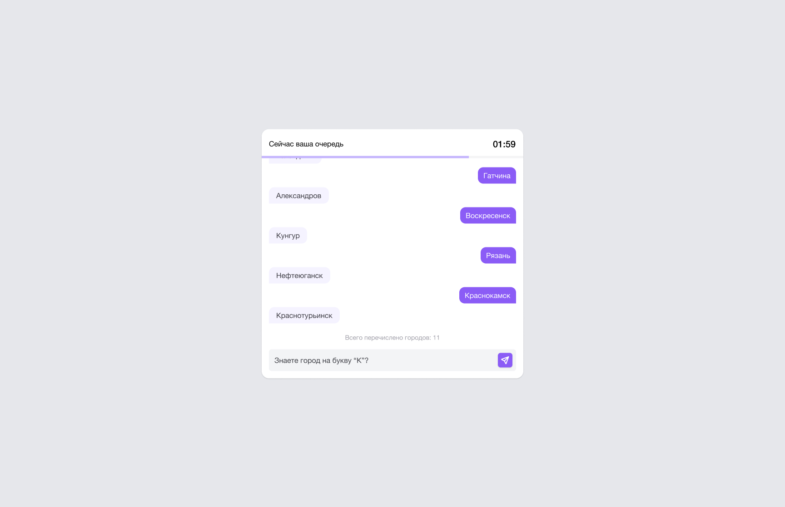
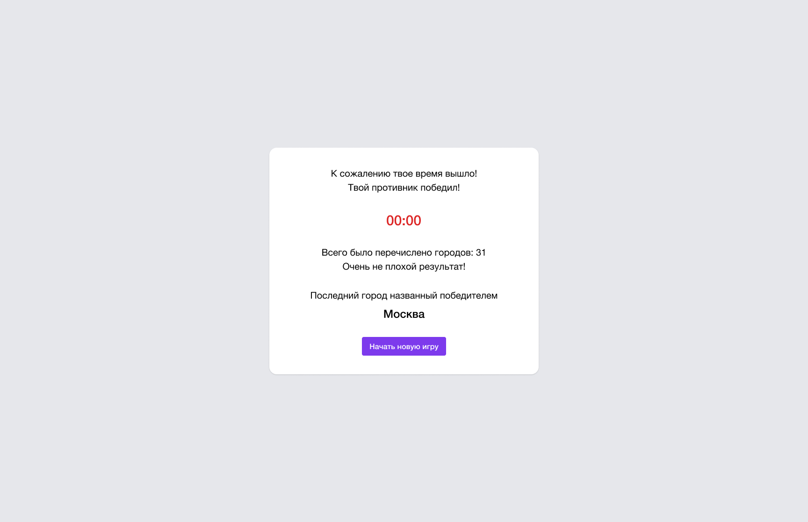
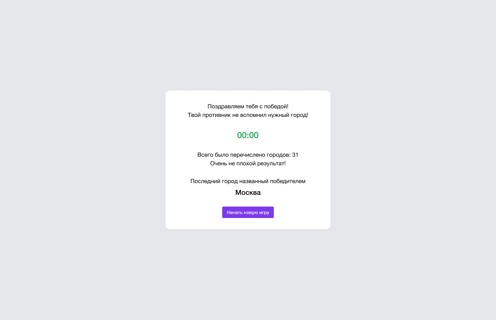

# Тестовое задание на frontend-разработчика

Привет!

Это страничка тестового задания для вакансии на frontend-разработчика.

Задание расчитано на ~3-4 часа. Что мы проверяем:

- Верстка, кроссбраузерная, адаптивная, применение Tailwind
- Умение работать с макетом в Figma
- Умение разделять код на компоненты
- Умение писать осознанные коммиты
- Умение предлагать варианты для решения поставленной задачи
- Код стайл, аккуратность (желательно использование prettier)
- Стремление к развитию, не бойся делать ошибки

## Задача

Необходимо разработать "легкую" версию онлайн-игры в "Города".

В качестве аппонента, мы предлагаем тебе написать функцию (искуственный интеллект, если можно так это назвать), которая будет брать города из заготовленного списка (список городов прилагается в репозитории). Главное не забудь учитывать правила игры – города не могут повторяться.

Для имитации живого игрока нужно написать функцию так, чтобы ответ от нее приходил с задержкой.

В репозитории есть [макет для Figma](https://github.com/qweik/frontend-test/raw/main/TestApp.fig), в котором ты можешь найти финальный дизайн для игры.
Обрати внимание на отступы, выравнивания по центру, на размерности.

В первой вкладке расположен макет, во второй tailwindcss конфигурация (она соответсвует конфигурации по умолчанию).

Все размеры в макете подходят под размеры tailwind классов. Например: максимальная ширина окна - 576px, соответсвует классу max-w-xl.

Для работы над текстом в первом слайде рекомендую использовать класс `.prose` из tailwind плагина [Typography](https://tailwindcss.com/docs/typography-plugin)

Так же необходимо реализовать таймер обратного отсчета, по умолчанию на 2 минуты. Если игрок или функция "ИИ" не успеет дать нужный ответ, мы можем определить победителя и проигравшего.

Для более качественной работы необходимо добавить валидацию вводимых городов на существование (1), по первой букве (2) и на повторение (3). (для упрощения проверяй существование города по имеющимуся списку городов)

## Стек и технические требования

- React 18 (можно с Next, можно без)
- Tailwind
- Использование typescript в проекте будет жирным плюсом

Роутинг делать не обязательно, если тебе будет достаточно работы в одном родительском компоненте.

Pixel Perfect оценивать не будем, но жирным плюсом будет, если классы из tailwind будут верно подобраны и подходить под размеры макета.

Решение должно быть выложено в публичном репозитории на github, чтобы можно было его проверить.

В остальном требований к проекту нет, можно использовать любые вспомогательные библиотеки на твой вкус (такие как day.js для работы с датой и тд).
Будет плюсом, если ты умеешь обходится без "готовых React компонентов".

## Результаты

Присылай свой вариант решения на почту [chaek-frontend@mail.ru](mailto:chaek-frontend@mail.ru) в виде ссылки на github репозиторий.

Если тебе что-либо не удалось реализовать, прикладывай пояснение к своей работе для общего разбора полетов. Мы приветсвуем любые результаты, даже если у тебя что-то не получается реализовать.

Все вопросы можно задавать на почте a@gldk.ru
или в телеграм [@qweik](https://t.me/qweik)

Желаем успехов! Надеемся, что задание окажется интересным!

## Скриншоты игры

  

  

  

  

  

  

